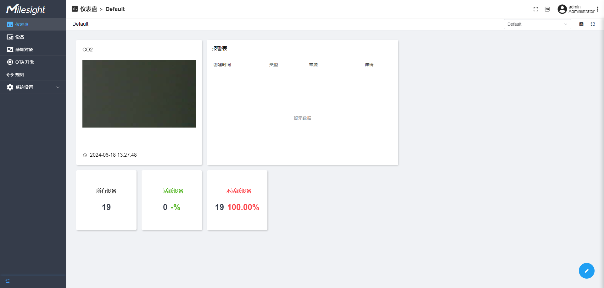

# 感知平台 



感知平台是基于Thingsboard（v3.5）开源项目二次开发的一个产品。在感知平台中，感知摄像机通过MQTT/HTTP方式将抓拍的图片和其他信息传输到感知平台，
而感知平台通过规则引擎将图片或其他内容推送到客户的具体应用平台中，起到一个规范数据包的数据中台作用，
并且我们提供了AI模块（AI推理平台）结合感知平台，将识别后的数据推送到具体的应用平台中，AI推理平台已内置表计识别等模型，可部署后直接使用。

<br/>

## 功能特性

**设备管理**：设备管理列表，可以查看设备信息，活跃状态和最新遥测数据，图片数据可以绘制ROI识别，OTA升级固件选择等

**Dashboard仪表盘**：可视化组件操作面板，提供3种仪表板，可以监控设备全局状态、图片动态变化和设备告警信息

**规则引擎和接收方**：三种类型规则链（Once data received、Low battery、Devices become inactive)

**感知对象定义**：支持对需要采集的设备数据进行定义

**设备OTA升级**：支持对设备进行OTA升级

**AI推理**：感知平台结合AI推理平台可实现图片ROI识别，识别后回推结果到感知平台，其中AI推理平台支持onnx模型的拓展

<br/>

## 快速开始

### Docker安装感知平台

> 本指南介绍了如何在Ubuntu Server 18.04/Ubuntu 20.04 LTS上安装感知平台
> 
> 首先，你需要一台4-8G内存的服务器或计算机运行感知平台

#### 1.下载和读取镜像

```
# 下载镜像
wget https://resource.milesight.com/milesight/iot/software/msaiotsensingplatform.tar
# 安装docker image
docker load -i msaiotsensingplatform.tar
```

#### 2.Docker文件准备

为感知平台创建配置文件

```
#创建docker执行文件
nano docker-compose.yml
```

将下列文本内容加入到yml文件中：

```
version: '3.0'
services:
  mysp:
    restart: always
    image: "msaiotsensingplatform:demo"
    ports:
      - "5220:9090"
      - "1883:1883"
      - "7070:7070"
      - "5683-5688:5683-5688/udp"
    environment:
      TB_QUEUE_TYPE: in-memory 
    volumes:
      - /var/mysp-data:/data
      - /var/mysp-logs:/var/log/msaiotsensingplatform
```

#### 3.为新建的文件夹创建用户权限

```
sudo useradd -m msaiotsensingplatform
sudo groupadd msaiotsensingplatform（提示已存在忽略）
sudo usermod -aG msaiotsensingplatform msaiotsensingplatform
mkdir -p /var/mysp-data && sudo chown -R msaiotsensingplatform:msaiotsensingplatform /var/mysp-data
chmod -R 777 /var/mysp-data
mkdir -p /var/mysp-logs && sudo chown -R msaiotsensingplatform:msaiotsensingplatform /var/mysp-logs
chmod -R 777 /var/mysp-logs
```

#### 4.在docker配置文件对应目录下运行镜像

启动镜像

```
docker compose up -d
```

启动后使用以下链接打开Web UI

```
http://localhost:5220/
```

<br/>

## 进一步使用

### 参考文档

如果你需要对感知平台进行二次开发或者需要结合AI推理平台使用，请查看完整文档[感知平台使用文档](https://github.com/1043021051/test/blob/main/%E6%84%9F%E7%9F%A5%E5%B9%B3%E5%8F%B0%E4%BA%8C%E5%BC%80.md)

<br/>

## 贡献指南

欢迎任何形式的贡献！请遵循以下步骤提交您的贡献：

1. Fork 本仓库
2. 创建您的特性分支 (git checkout -b feature/AmazingFeature)
3. 提交您的更改 (git commit -m 'Add some AmazingFeature')
4. 推送到分支 (git push origin feature/AmazingFeature)
5. 打开一个 Pull Request


## 社区

加入我们的社区，获取帮助、分享经验、讨论项目相关内容：

- [Discord](https://discord.gg/vNFxbwfErm "Discord")
- [Github](https://github.com/Milesight-IoT "GitHub")

## 关注Milesight

- [Linkedin](https://www.linkedin.com/company/milesightiot "Linkedin")
- [Youtube](https://www.youtube.com/c/MilesightIoT "Youtube")
- [Facebook](https://www.facebook.com/MilesightIoT "Facebook")
- [Instagram](https://www.instagram.com/milesightiot/ "Instagram")
- [Twitter](https://twitter.com/MilesightIoT "Twitter")
- [Milesight-Evie](https://www.linkedin.com/in/milesight-evie/ "Milesight-Evie")

## 许可证

此存储库在 [MIT](LICENSE)下可用
